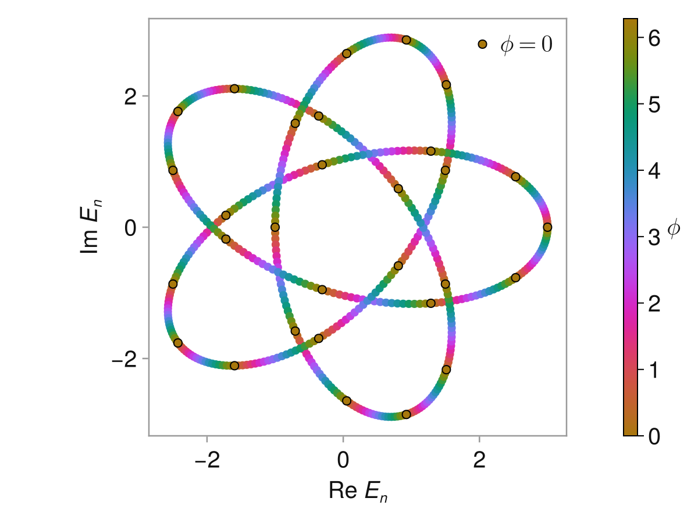
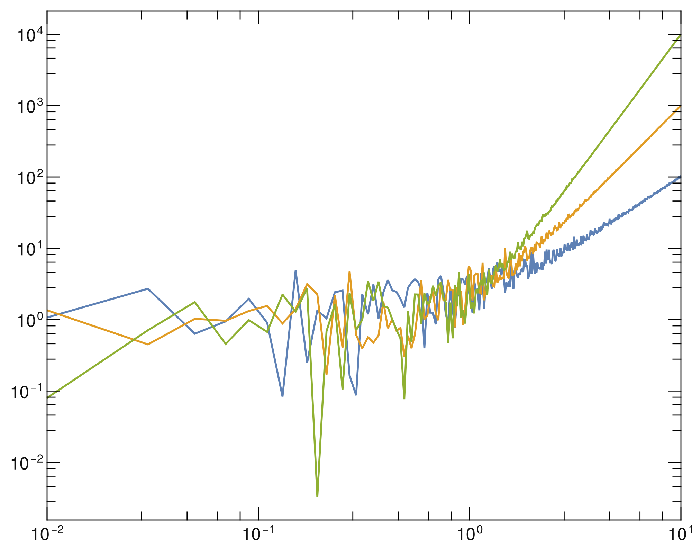

# BetoThemes
I like mathematica, sue me.




# Installation
```julia
using Pkg
Pkg.add(url="https://github.com/biestro/BetoThemes.git")
Pkg.update("BetoThemes")
using BetoThemes
```

# Dependencies
```julia
Makie # CairoMakie backend
Colors
LaTeXStrings
MathTeXEngine
ColorSchemes
```
